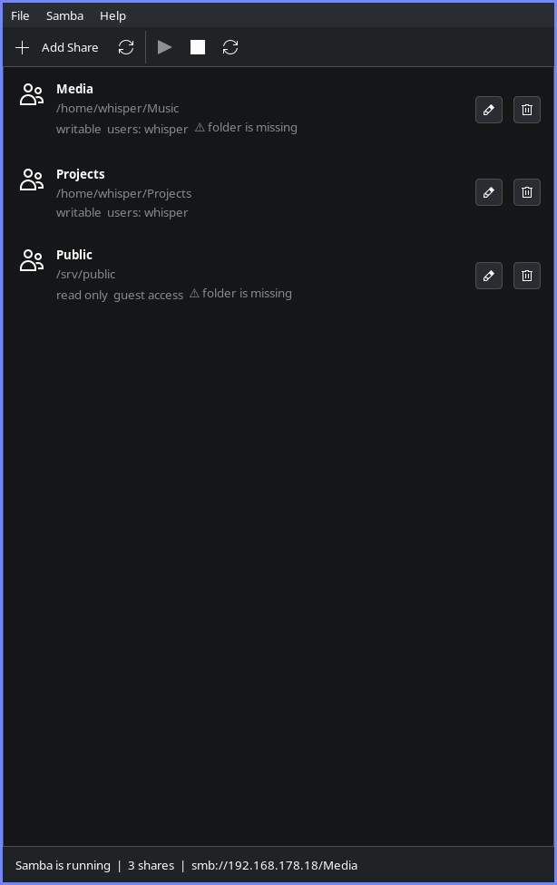

# SMB Manager


A small GTK3 desktop application for Arch Linux that turns "I want to share this
folder with my other machines" into a two minute job:

* installs the `samba` package when it is missing,
* starts, stops, restarts Samba and toggles whether it runs at boot,
* creates, edits and removes shares with a folder picker,
* defaults every new share to the current user,
* sets that user's Samba password.

The window follows the traditional GTK layout Thunar uses — server side
decorations, a menubar, a toolbar and a statusbar — rather than a client side
header bar.



## Install

```sh
git clone https://github.com/KsmBl/smbmanager.git
cd smbmanager
sudo ./install.sh          # /usr, python site-packages, polkit action
```

To remove it again:

```sh
sudo ./install.sh --uninstall     # /etc/samba/smbmanager.conf is kept
```

Or build a package: `makepkg -si` in the project directory.

Runtime dependencies: `python`, `python-gobject`, `gtk3`, `polkit`.
`samba` itself is optional — the app installs it for you.

It also runs straight from a checkout without installing anything:

```sh
./bin/smbmanager
```

## First run

1. If Samba is missing, the info bar offers **Install Samba**. On a system with
   pending updates it offers a full update instead — see
   [Troubleshooting](#troubleshooting-samba-cannot-start) for why that matters.
2. **Samba → Set Samba Password…** once, so clients can authenticate as you.
3. **Add Share** (`Ctrl+N`), pick a folder. The share name is filled in from the
   folder and the allowed user defaults to you.
4. **Samba → Start**, and tick **Start at Boot** if you want it permanent.

The statusbar shows where to reach the share, for example
`smb://192.168.178.18/Media`. From Windows that is `\\192.168.178.18\Media`.

## How it works

The application itself is unprivileged. Everything that needs root goes through
`helper/smbmanager-helper`, a small script with a fixed command vocabulary
(`install`, `service`, `apply`, `passwd`, `deluser`, `mkdir`, `status`) that is
started with `pkexec`. Passwords are passed on stdin, never on the command line,
so they never show up in `ps`.

Shares are **not** written into your `smb.conf`. They live in
`/etc/samba/smbmanager.conf`, which is pulled in by a single `include` line:

```ini
[global]
   ...
   include = /etc/samba/smbmanager.conf
```

If `/etc/samba/smb.conf` does not exist yet (Arch's samba package ships no
default), the helper writes a sane standalone-server config. If it does exist,
the helper backs it up to `smb.conf.smbmanager.bak` before appending the
include, and never touches anything else in it. Every configuration change is
run through `testparm` before it is installed, so a rejected config can never
take your file server down.

## About passwords

Samba keeps its own password database (`passdb.tdb`), and Linux stores login
passwords as one-way hashes in `/etc/shadow`. **No program can copy your system
password into Samba** — it cannot be read back, not even by root.

So the app does the next best thing: the *user name* of a new share defaults to
you, and *Set Samba password…* asks once for a password to store in Samba's
database. Type your system password there and the two stay in sync; type
something else and you have a separate share-only password. Either way you only
do it once.

## Troubleshooting: Samba cannot start

Arch is a rolling release, and `samba`'s binaries link against private libraries
shipped by `smbclient`. Installing `samba` alone on a system whose other
packages are a few days old therefore produces a **partial upgrade**: pacman
succeeds, but the dynamic linker refuses to start `smbd`:

```
/usr/bin/smbd: /usr/lib/samba/libsamba3-util-private-samba.so:
    version `SAMBA_4.24.6_PRIVATE_SAMBA' not found (required by /usr/bin/smbd)
```

SMB Manager handles this in three places:

* **Before installing** it lists outdated Samba packages and offers to run a
  full system update instead of creating the mismatch.
* **After installing** it runs `smbd --version` — pacman exiting successfully is
  not proof the daemon can run — and reports the real problem if it cannot.
* **At every start** it checks the same thing without needing root (the linker
  reports the mismatch to any user) and replaces Start/Stop with a *Repair*
  button that runs the full update.

If you hit it outside the app, the fix is always:

```sh
sudo pacman -Syu
```

## Notes

* `smb.service` and `nmb.service` are handled together; `nmb` is what makes the
  machine show up in the Windows network neighbourhood.
* If you run a firewall, open TCP 445 (and 139/UDP 137-138 for NetBIOS):
  `sudo ufw allow samba` or `sudo firewall-cmd --add-service=samba`.
* Guest shares access files as your user account, so the file permissions of
  that account apply.
* SMB1 is disabled in the generated config (`server min protocol = SMB2_10`).
* When `systemctl` refuses to start the service, the error dialog includes the
  last lines of `journalctl -u smb.service`, so you see the actual reason
  instead of "job failed".

## Layout

```
bin/smbmanager                  launcher
smbmanager/shares.py            share file parser / writer
smbmanager/system.py            status queries, pkexec calls, app state
smbmanager/dialogs.py           share editor and password prompt
smbmanager/window.py            main window: menubar, toolbar, list, statusbar
helper/smbmanager-helper        the only part that runs as root
data/*.desktop, *.policy        menu entry and polkit action
```


## License

GPL-3.0. See [LICENSE](LICENSE).
